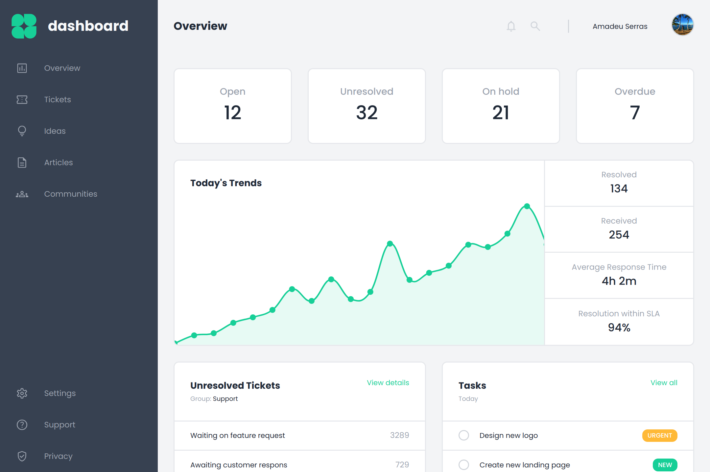

# Admin-Dashboard 📋

[👉 Demo](https://nightrunner4.github.io/admin-dashboard)

### About 📖

Las project of intermediate HTML and CSS of The Odin Project. A good CSS grid & flexbox practice.

### Resources Used 📚

- [Mmackz github user](https://github.com/Mmackz/admin-dashboard) (Design)
- [Figma Design](https://figma.com/community/file/809559910249051285) (Design)
- [Google Fonts](https://fonts.google.com/) (Icons & Font)
- [Logoipsum](https://logoipsum.com) (Placeholder Logo)
- [MagicPattern](https://magicpattern.design/tools/svg-chart-generator) (Placeholder Chart)

### Built With 🛠️

- HTML
- CSS
